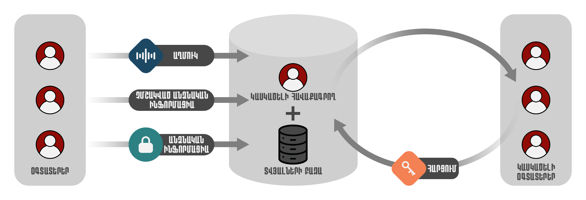
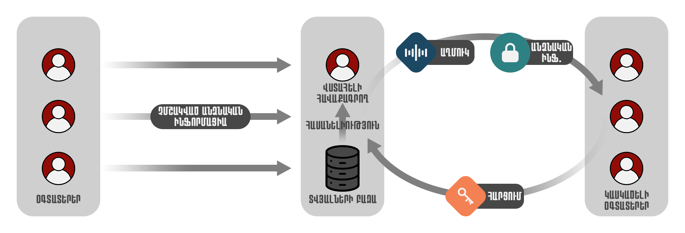
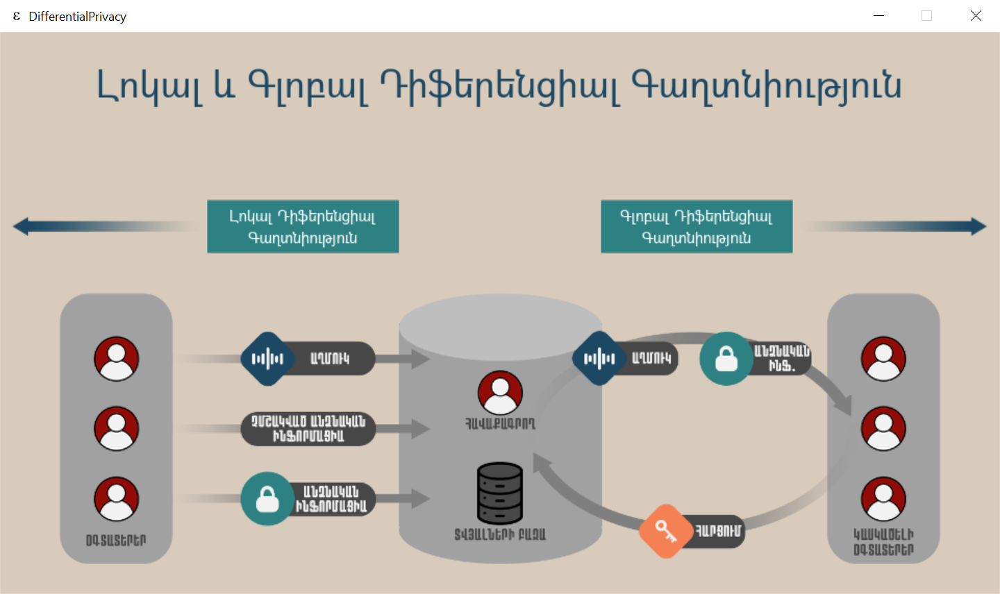
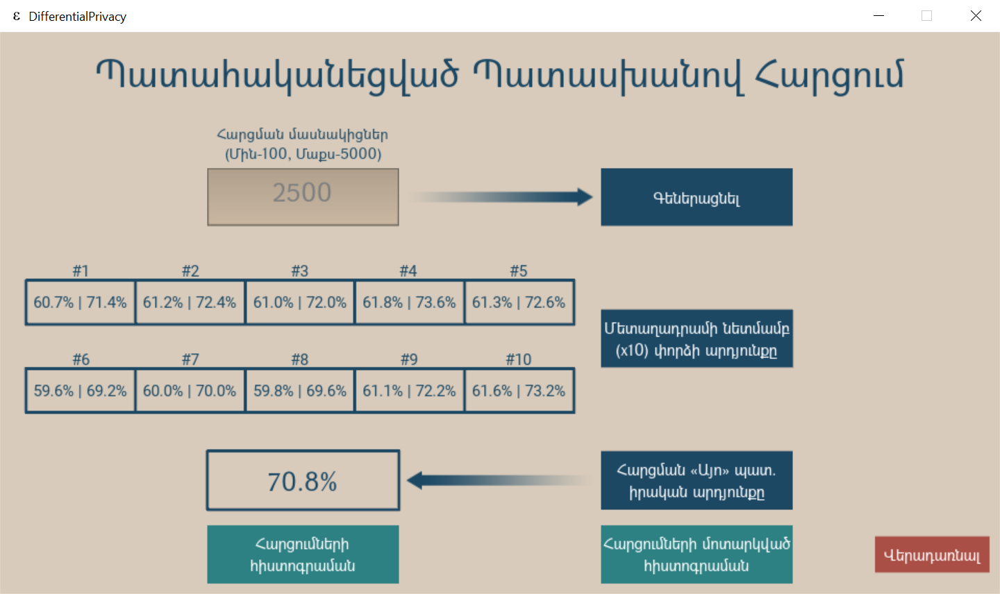
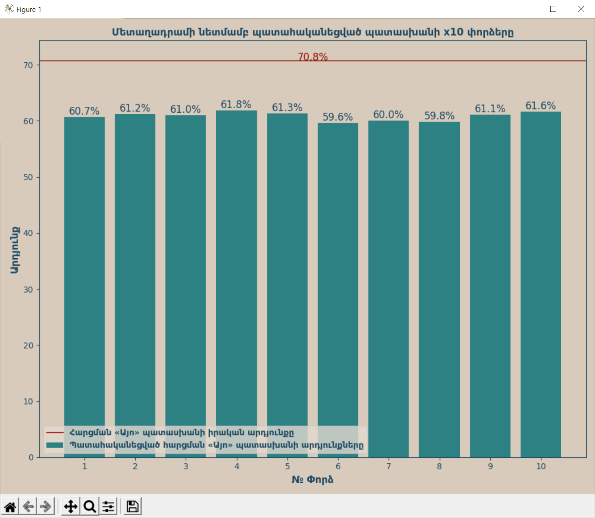
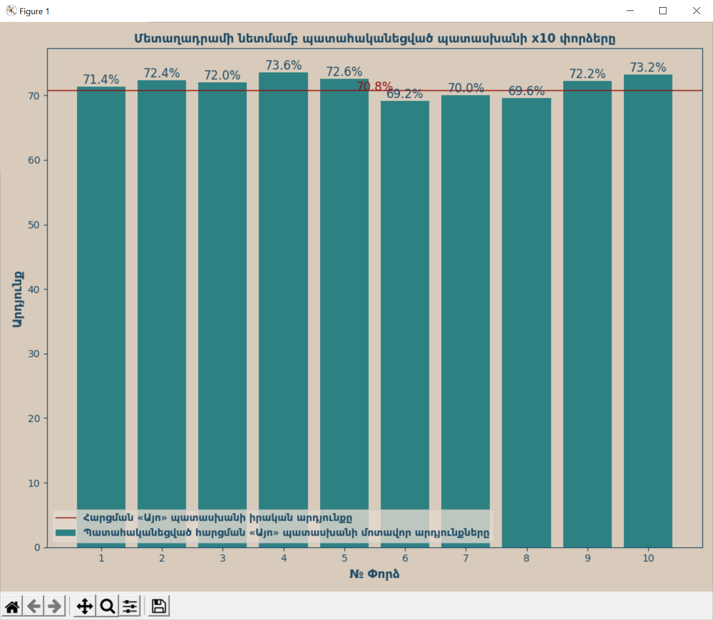
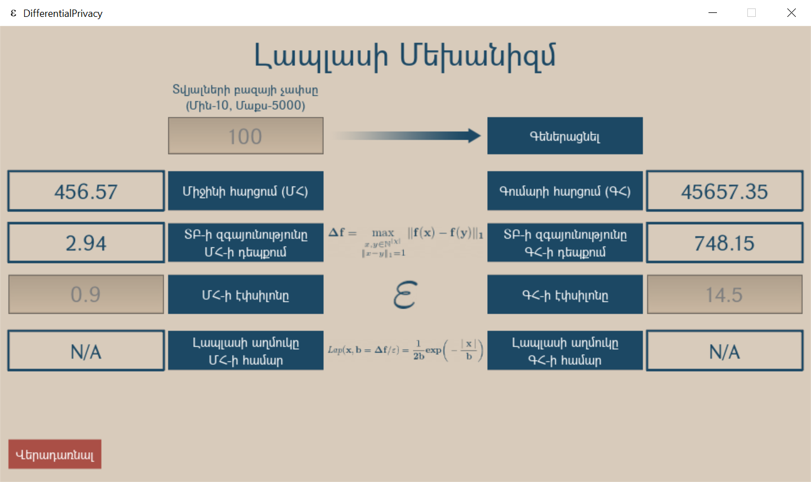
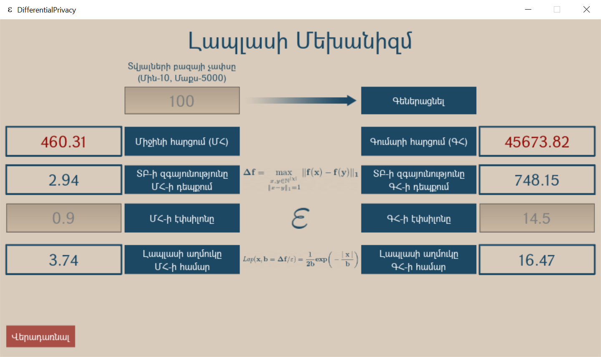

# NPUA BCompSc Final Project


### Table of Contents

- [Description](#description)
- [How To Use](#how-to-use)
- [How To Install Dependencies](#how-to-install-dependencies)

---

## Description

Project describes methods of Local and Global Differential Privacy

#### Methods
- Local Differential Privacy 
- Global Differential Privacy 

[Back To The Top](#npua-bcompsc-final-project)

---
## How To Use
- Click the left button to move to Local DP and right button to move to Global DP. 
- Randomized Response
    - Input the amount of survey members, then click x10 button 10 times to show the results, then click the real result button to show the survey's "Yes" answer real percentage. 
    - Click the queries histogram to see results of 10 surveys. 
    - Click the approximate queries histogram to see approximate results of 10 surveys. 
- Laplace Mechanism
    - Input the database size, then click the mean or sum query to see the query result, then click the corresponding button to see the database sensitivity, then input the epsilon-privacy budget. 
    - To add noise to the query result click the laplace noise button, then the query result will change. 

[Back To The Top](#npua-bcompsc-final-project)

---

## How To Install Dependencies

#### Installation

```
pip install -r requirements.txt
```
or
```
pip install Kivy==2.0.0
pip install numpy==1.20.2
pip install matplotlib==3.4.0
```

[Back To The Top](#npua-bcompsc-final-project)
